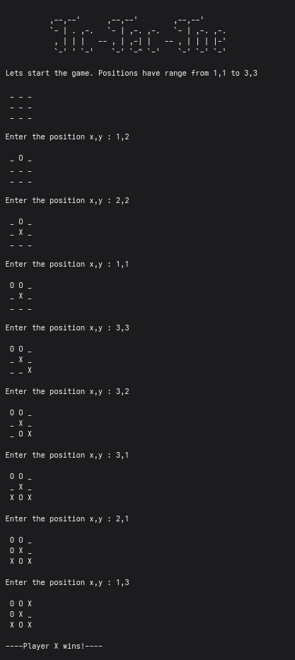

# ⭕ Tic-Tac-Toe 

A classic command-line implementation of the game **Tic-Tac-Toe** (also known as Noughts and Crosses), written in **C++**.

---

## 🌟 Features

* **Standard 3x3 Grid:** Play on the familiar 3x3 board.
* **Two-Player Mode:** Supports local play between two human players.
* **Input Validation:** Ensures players make valid moves (e.g., placing marks only on empty squares).
* **Win Detection:** Automatically determines the winner or declares a draw.

## Screenshot

Here's a screenshot of the interface:

